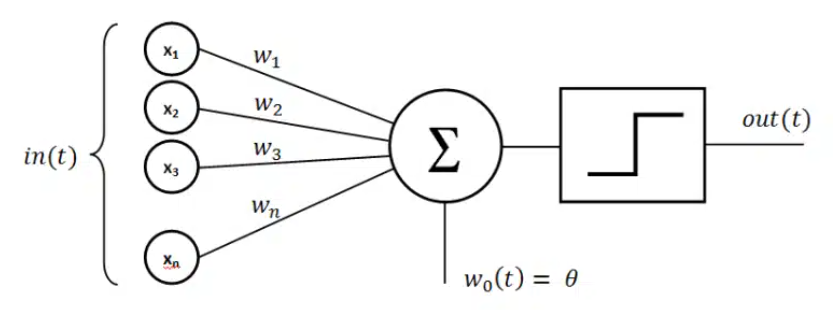

# The Perceptron

The Perceptron is one of the earliest models of a neural network and a foundational element in the history of artificial intelligence and machine learning. Its simple structure and learning mechanism laid the groundwork for modern deep learning. Here’s an overview of the perceptron’s history, concept, and impact.

## Historical Background
- **Origin:** The perceptron was invented in 1957 by Frank Rosenblatt, an American psychologist and computer scientist at the Cornell Aeronautical Laboratory.
- **Goal:** Rosenblatt aimed to create a machine that could simulate the way the human brain recognizes and categorizes information, particularly in pattern recognition tasks like image and speech recognition.
- **Initial Success: In the late 1950s and early 1960s, the perceptron attracted considerable attention as an "intelligent" machine capable of learning. It was the first algorithmically defined model that could adjust its parameters (weights) based on input data.

## Concept and Structure of the Perceptron
The perceptron is a type of artificial neuron or binary linear classifier. It can be thought of as a very basic neural network with a single neuron that maps inputs to an output, based on a set of adjustable weights.

- **Inputs:** Each perceptron takes multiple input features (e.g., pixel values of an image, attributes of a dataset entry).
- **Weights:** Each input is multiplied by an associated weight, representing the importance of that input feature.
- **Bias:** A bias term is added to the weighted sum to allow the model to adjust the threshold for activation.
- **Activation Function:** The perceptron applies a step activation function:
    - If the weighted sum of inputs (plus bias) is greater than or equal to 0, it outputs 1.
    - Otherwise, it outputs 0.
    - This step function is commonly used for binary classification, which categorizes input data into two groups.

## Learning Process (Training the Perceptron)
The perceptron adjusts its weights using a learning rule, which allows it to "learn" from mistakes. The learning algorithm is typically a form of gradient descent, following these steps:

1. **Initialize weights** randomly or with small values.
2. **Make a prediction** for each training example by calculating the weighted sum of inputs and applying the activation function.
3. **Calculate the error** by comparing the predicted output with the actual label.
4. **Adjust the weights** based on this error to reduce the difference between the prediction and the actual output.
5. **Repeat the process** (often over multiple epochs) until the perceptron makes accurate predictions for all examples in the training set, or until it reaches a maximum number of epochs.

The weight update rule is simple: 𝑤(i) = 𝑤(𝑖) + learning rate × (label − prediction) × input(𝑖)
​

This training process works well for linearly separable data, where classes can be separated by a straight line (or hyperplane in higher dimensions).

## Limitations of the Perceptron
The perceptron, while revolutionary, has significant limitations:

- **Inability to Learn Non-Linear Patterns:** A single-layer perceptron cannot solve problems that aren’t linearly separable. For example, the classic XOR problem (where the relationship between inputs and output cannot be separated with a single line) cannot be learned by a single perceptron.
- **Single Layer:** The basic perceptron model consists of only one layer, making it a limited model for complex pattern recognition tasks. Multi-layer networks (MLPs) are needed to handle non-linear patterns.

In 1969, Marvin Minsky and Seymour Papert published a book titled Perceptrons, which highlighted these limitations, particularly the XOR problem, and led to a decline in research interest and funding for neural networks—a period known as the AI Winter.

## Impact and Legacy
Despite its limitations, the perceptron’s importance in machine learning cannot be understated:

- **Foundation of Neural Networks:** The perceptron model laid the groundwork for more complex architectures, such as multi-layer perceptrons (MLPs) and deep neural networks, which address the limitations of a single-layer perceptron.
- **Revival in Deep Learning:** While the original perceptron is rarely used today, its principles (weights, bias, activation functions) remain central in modern neural network architectures.
- **Inspiration for Backpropagation:** Although not used in the perceptron, the concept of updating weights based on errors was essential in developing the backpropagation algorithm, which enables multi-layer neural networks to learn complex patterns.

## Code explanations

### 1. Initialization

- The perceptron initializes with random weights for each input feature plus a bias.
- self.weights includes an extra weight for the bias, which helps shift the activation threshold.

### 2. Activation Function

- Uses a step function that outputs 1 if the input is 0 or greater, otherwise 0. This is typical for binary classification.

### 3. Predict Function:

- Calculates the weighted sum of the inputs and applies the step function to produce a binary output.

### 4. Training Function:

- For each training example, it calculates the error (difference between the actual label and prediction).
- Adjusts weights based on this error, using gradient descent.
