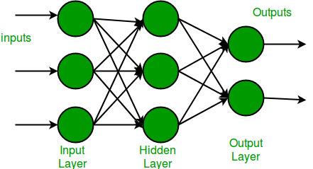

# Multi-Layer Perceptron (MLP)

The Multi-Layer Perceptron (MLP) is a type of Artificial Neural Network (ANN) that introduces hidden layers between the input and output layers, enabling it to learn complex, non-linear patterns. It is a foundational architecture in deep learning, capable of solving both linear and non-linear problems.

## Historical Background

- **Origin:** The MLP is an extension of the perceptron, introduced to address its inability to solve non-linear problems (e.g., XOR). This was achieved by adding one or more hidden layers and applying non-linear activation functions.
- **Development:** The breakthrough for training MLPs came with the introduction of the backpropagation algorithm in the 1980s by Geoffrey Hinton, David Rumelhart, and Ronald Williams.
- **Goal:** To build a network that could approximate any continuous function, making it capable of handling a wide variety of machine learning tasks.

## Concept and Structure of the MLP
An **MLP** is composed of:

- **Input Layer:** Receives the input features.
- **Hidden Layers:** Layers between the input and output that process and transform data using non-linear activation functions.
- **Output Layer:** Produces the final predictions, typically using activation functions like sigmoid (binary classification) or softmax (multi-class classification).
- **Key Features of an MLP
- **Non-Linearity:** Uses non-linear activation functions (e.g., sigmoid, ReLU) in the hidden layers to model non-linear relationships.
- **Fully Connected Layers:** Each neuron in a layer is connected to all neurons in the previous and subsequent layers.
- **Backpropagation:** Weights are adjusted using the backpropagation algorithm, which propagates errors backward through the network.
- **Versatility:** Can handle both regression and classification tasks, provided enough neurons and layers are included.

## Learning Process in MLP

1. **Forward Pass:** Input data is passed through the network layer by layer to compute the final output.

2. **Error Calculation:** The difference between predicted and actual output is computed using a loss function (e.g., mean squared error, cross-entropy loss).

3. **Backward Pass (Backpropagation):**
- Gradients of the loss function with respect to weights are calculated using the chain rule.
- Weights are updated using gradient descent.

4. **Repeat:** The process continues for multiple epochs until the network minimizes the error.

## Code Explanation

### 1. Initialization
- **Weights and Biases:**
    - Randomly initialized for all connections between layers (input to hidden and hidden to output).
    - Separate biases for the hidden and output layers.
- **Learning Rate:** Controls the step size for updating weights during training.

### 2. Activation Function
- **Sigmoid Function:** Used in the hidden and output layers to introduce non-linearity.
    - Sigmoid squashes values into the range (0, 1), enabling the network to model non-linear relationships.
- **Sigmoid Derivative:** Needed during backpropagation to calculate gradients.

### 3. Forward Pass
- **Hidden Layer:** Computes the weighted sum of inputs, adds biases, and applies the sigmoid activation function.
- **Output Layer:** Takes the output of the hidden layer, applies weights and biases, and uses the sigmoid activation function to compute the final prediction.

### 4. Error Calculation
- The difference between the predicted output and the actual label is calculated to measure the performance of the network.
- A loss function, like mean squared error, is used to aggregate the errors.

### 5. Backward Pass (Backpropagation)
- **Output Layer Gradients:** Compute the gradients of the loss with respect to the output layer weights and biases.
- **Hidden Layer Gradients:** Backpropagate the error from the output layer to the hidden layer, adjusting hidden layer weights and biases accordingly.
- **Weight Updates:** Adjust weights and biases using the calculated gradients, scaled by the learning rate.

### 6. Training Loop
- **Epochs:** The network iterates through the entire dataset multiple times, updating weights at each step.
- **Loss Monitoring:** The loss is periodically computed and printed to monitor training progress.

## Advantages of MLP
- **Universal Approximator:** Capable of approximating any continuous function with enough neurons and layers.
- **Non-Linear Learning:** Can solve non-linear problems like XOR, unlike the perceptron.
- **Versatility:** Applicable to regression, classification, and time-series prediction tasks.

## Limitations of MLP
- **Computational Cost:** Training large MLPs can be computationally expensive.
- **Overfitting:** Prone to overfitting without proper regularization techniques (e.g., dropout, weight decay).
- **Interpretability:** It’s difficult to interpret what the network has learned, especially with many layers.

## Impact and Legacy
The Multi-Layer Perceptron (MLP) is a key milestone in the development of neural networks. It has played a significant role in:

- Enabling neural networks to solve complex, non-linear problems.
- Forming the basis of modern deep learning architectures, such as Convolutional Neural Networks (CNNs) and Recurrent Neural Networks (RNNs).
- Pioneering methods like backpropagation, which remain essential in contemporary neural network training.

The MLP remains a powerful and widely used model, serving as both a foundational concept and a practical tool in machine learning.