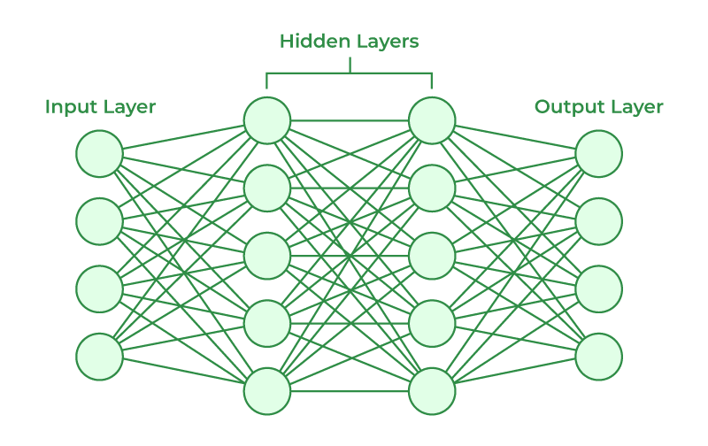

# Artificial Neural Networks (ANN)

An Artificial Neural Network (ANN) is a foundational concept in artificial intelligence and machine learning, inspired by the structure and function of biological neural networks. ANNs are more advanced than perceptrons, as they allow for multiple layers and neurons, enabling the network to model both linear and non-linear patterns. Here’s an overview of single-layer and multi-layer ANNs, their history, structure, and impact.

## Historical Background
- **Origin:** Building upon the perceptron developed by Frank Rosenblatt in the late 1950s, ANNs emerged to overcome the limitations of single-layer perceptrons, particularly their inability to solve non-linear problems like the XOR problem.
- **Key Contributions:**
    - In the 1960s, the idea of introducing hidden layers was proposed, leading to the concept of multi-layer networks.
    - In the 1980s, the backpropagation algorithm was introduced (popularized by Geoffrey Hinton), enabling efficient training of multi-layer ANNs.
- **Goal:** ANNs were designed to simulate more complex functions of the human brain, including pattern recognition, language processing, and decision-making.

## Concept and Structure of Single-Layer ANN

A single-layer ANN is an extension of the perceptron model, where multiple output neurons allow for multi-class classification. This architecture is limited to linearly separable data.

- **Input Layer:** Receives input features.
- **Output Layer:** Contains multiple neurons, each representing a possible class in a multi-class problem.
- **Weights and Biases:** Each neuron has its own set of weights and a bias, which are adjusted during training.
- **Activation Function:** Applies a step function or sigmoid function to determine the output of each neuron.

### Learning Process in Single-Layer ANN
1. **Initialize weights** randomly for each input-output connection.
2. **Forward Pass:** Compute the weighted sum for each output neuron and apply the activation function.
3. **Error Calculation:** Compute the difference between predicted and actual outputs for each neuron.
4. **Weight Updates:** Adjust weights using gradient descent, scaled by the learning rate.

### Limitations of Single-Layer ANN
- **Linear Separation Only:** Can only classify linearly separable problems, similar to a perceptron.
- **No Hidden Layers:** Cannot capture non-linear relationships in data.

## Concept and Structure of Multi-Layer ANN
A **multi-layer ANN** overcomes the limitations of single-layer ANNs by introducing hidden layers, enabling the network to learn complex, non-linear relationships.

- **Input Layer:** Passes the input features to the hidden layer.
- **Hidden Layers:** Intermediate layers between the input and output layers that transform the data through non-linear activation functions (e.g., sigmoid, ReLU).
- **Output Layer:** Produces the final predictions, typically using activation functions like sigmoid (for binary classification) or softmax (for multi-class classification).
- **Activation Functions:** Non-linear functions applied in the hidden layers to capture non-linear patterns.
- **Learning Algorithm:** Trained using backpropagation, which adjusts weights by propagating the error backward through the network.

### Learning Process in Multi-Layer ANN
1. **Forward Pass:**
- Compute the output of the hidden layer(s).
- Pass the output of each hidden layer to the next layer until the output layer produces the predictions.

2. **Error Calculation:**
- Compare predicted outputs with actual outputs to compute the error (e.g., using mean squared error or cross-entropy loss).

3. **Backward Pass:**
- Calculate gradients of the error with respect to each weight using the chain rule (backpropagation).
- Update weights using gradient descent or a variant like stochastic gradient descent (SGD).

### Advantages of Multi-Layer ANN
- **Handles Non-Linearity:** Captures complex, non-linear relationships in data.
- **Universal Approximator:** Can approximate any continuous function with sufficient layers and neurons.

## Code Explanations

### Single-Layer ANN

1. **Initialization:**

- Randomly initializes weights for each input-output connection and biases for each output neuron.

2. **Activation Function:**

- Applies a step function to classify each output neuron as 1 or 0.

3. **Forward Pass:**

- Computes the weighted sum for each output neuron and applies the activation function.

4. **Training:**

- Calculates the error for each output neuron and adjusts weights using gradient descent.

### Multi-Layer ANN

1. **Initialization:**

- Randomly initializes weights and biases for each layer in the network (input to hidden and hidden to output).

2. **Activation Function:**

- Applies a sigmoid function or ReLU in hidden layers and a sigmoid or softmax in the output layer.

3. **Forward Pass:**

- Passes the input data through the hidden layer(s), applying weights, biases, and activation functions at each layer.

4. **Backpropagation:**

- Computes gradients of the error with respect to weights in each layer, propagating the error backward through the network.

5. **Weight Updates:**

- Updates weights and biases using gradient descent.

## Limitations of ANNs
- **Computational Complexity:** Training multi-layer networks can be computationally expensive.
- **Overfitting:** Without regularization, ANNs may overfit to training data, reducing generalization to unseen data.
- **Interpretability:** As networks grow deeper, it becomes difficult to interpret how decisions are made.

## Impact and Legacy

- **Single-Layer ANN:** While limited, the single-layer ANN introduced multi-class classification, paving the way for more complex architectures.
- **Multi-Layer ANN:** Represented a major breakthrough in machine learning, enabling tasks like image recognition, language translation, and autonomous systems.

Both single-layer and multi-layer ANNs remain foundational concepts in neural networks, influencing modern deep learning architectures.